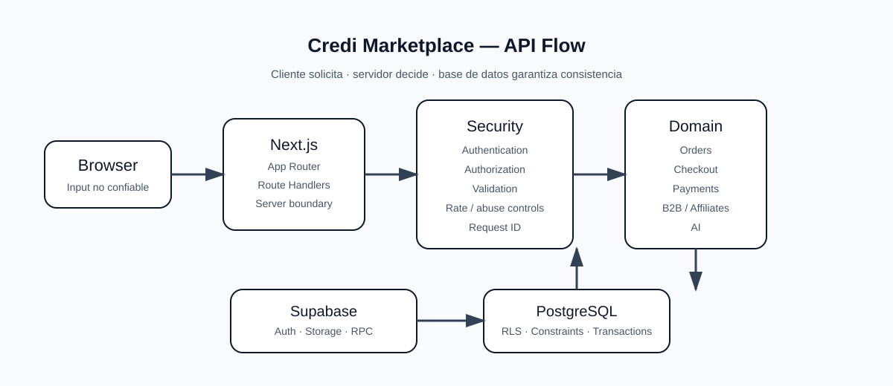

# Credi Marketplace — API Contract

> Contrato técnico para Route Handlers, integraciones de Supabase y operaciones de negocio. Los endpoints concretos implementados en `src/app/api/` son la fuente ejecutable; este documento define las reglas que deben cumplir.

## 1. Arquitectura

```text
Browser
  ↓
Next.js 16 App Router
  ↓
Route Handler / Server boundary
  ↓
Auth + Authorization + Validation
  ↓
Domain logic
  ↓
Supabase / PostgreSQL / RPC
  ↓
Safe response
```

El navegador nunca es fuente de verdad para precio, stock, comisión, rol, ownership o estado de pago.

## 2. Convenciones

| Elemento | Convención |
|---|---|
| JSON | `application/json` |
| IDs | UUID cuando el modelo utilice UUID |
| Errores | `success: false` + `code` estable |
| Operaciones privadas | autenticación + autorización |
| Datos sensibles | `Cache-Control: no-store` |
| Trazabilidad | `requestId` cuando corresponda |
| Validación | esquema/contrato antes de ejecutar dominio |

## 3. Respuesta estándar

### Éxito

```json
{
  "success": true,
  "data": {}
}
```

### Error

```json
{
  "success": false,
  "error": "No fue posible completar la operación.",
  "code": "OPERATION_FAILED"
}
```

Nunca exponer stack traces, SQL, credenciales o detalles internos del proveedor.

## 4. Códigos HTTP

| Código | Uso |
|---:|---|
| 200 | éxito |
| 201 | recurso creado |
| 204 | éxito sin contenido |
| 400 | request inválido |
| 401 | no autenticado |
| 403 | no autorizado |
| 404 | recurso no encontrado |
| 409 | conflicto / concurrencia / estado |
| 415 | content type no soportado |
| 422 | entidad semánticamente inválida |
| 429 | demasiadas solicitudes |
| 500 | error interno |
| 503 | servicio temporalmente no disponible |

## 5. Autenticación

Supabase Auth gestiona la identidad. Las Route Handlers privadas deben obtener la sesión desde el contexto seguro del servidor.

El rol enviado por el cliente no concede privilegios.

```text
session
  ↓
user identity
  ↓
role / ownership
  ↓
permission
```

## 6. Catálogo público

Las consultas públicas deben devolver únicamente datos de catálogo destinados al usuario final.

```http
GET /marketplace
GET /marketplace/products/[slug]
```

No devolver secretos, datos privados del vendedor, información administrativa ni información de otros usuarios.

## 7. Órdenes

```http
POST /api/orders
```

### Input conceptual

```json
{
  "product_id": "uuid",
  "quantity": 2,
  "affiliate_ref": "REFERENCIA"
}
```

El servidor debe:

```text
authenticate
↓
validate input
↓
load trusted product
↓
validate active state
↓
validate stock
↓
resolve real price
↓
validate affiliate
↓
transaction/RPC
↓
create pending order
```

El cliente no puede definir el precio final, el total, el seller, el buyer o el estado de la orden.

## 8. Checkout

```http
POST /api/checkout
```

El checkout es una operación financiera y debe repetir las validaciones críticas aunque ya se hayan realizado en la UI.

```json
{
  "items": [
    {
      "id": "uuid",
      "quantity": 2
    }
  ]
}
```

### Regla financiera

```text
UI price       ≠ trusted price
UI stock       ≠ reserved stock
checkout call  ≠ payment confirmation
```

El servidor vuelve a calcular subtotal, comisiones, disponibilidad y totales desde fuentes confiables.

## 9. Pagos

Flujo normativo:

```text
order created
      ↓
pending
      ↓
payment initiated
      ↓
provider
      ↓
verified webhook / server confirmation
      ↓
paid
```

Nunca aceptar:

```json
{
  "paid": true
}
```

desde el navegador como prueba de pago.

## 10. Webhooks

Los webhooks son endpoints públicos potencialmente atacables. Deben validar:

- autenticidad/firma del proveedor;
- timestamp o replay protection cuando el proveedor lo soporte;
- idempotencia;
- relación con la orden/pago;
- estado actual antes de aplicar una transición.

Un webhook repetido no debe duplicar efectos.

## 11. Idempotencia

Las operaciones sensibles deben aceptar una clave de idempotencia cuando su contrato lo requiera.

```http
Idempotency-Key: <unique-request-key>
```

Aplicar especialmente a:

```text
orders
checkout
payments
webhooks
```

## 12. Inventario

El stock debe protegerse contra concurrencia.

Incorrecto:

```text
read stock
↓
check
↓
write stock
```

Correcto:

```text
transaction / RPC
↓
lock/validate
↓
create order
↓
update inventory
↓
commit
```

## 13. Afiliados

La referencia de afiliado es input no confiable hasta ser validada.

Validar, según el modelo activo:

```text
existence
active state
valid attribution
eligibility
self-referral rules
commission rules
```

La comisión debe calcularse en servidor.

## 14. B2B

Las operaciones B2B mantienen la misma frontera de seguridad:

```http
GET  /b2b
GET  /b2b/[id]
POST /api/b2b/...
```

El servidor debe validar MOQ, stock, precio, proveedor, condiciones comerciales y autorización del comprador cuando el modelo lo requiera.

## 15. IA

La IA debe exponerse únicamente mediante una frontera de servidor controlada.

```http
POST /api/ai/assistant
```

Input conceptual:

```json
{
  "message": "Consulta del usuario"
}
```

Controles:

```text
input validation
size limit
rate limiting
server-side API key
provider timeout
safe error handling
cost control
```

Nunca utilizar una variable privada como `NEXT_PUBLIC_GEMINI_API_KEY`.

## 16. Autorización administrativa

Las rutas administrativas deben validar tanto autenticación como autorización.

```text
authenticated ≠ admin
```

El control de acceso debe existir en servidor y no depender de que una página esté oculta en la UI.

## 17. Cache

Las APIs privadas y transaccionales deben impedir caché público accidental:

```http
Cache-Control: private, no-store
```

Especialmente:

```text
/api/auth/*
/api/orders/*
/api/checkout/*
/api/payments/*
/api/ai/*
```

## 18. Request IDs

Para operaciones sensibles puede generarse:

```ts
crypto.randomUUID()
```

El identificador puede correlacionar aplicación, backend y proveedor externo sin almacenar secretos.

## 19. Timeouts

Las llamadas a proveedores externos deben tener timeout y cancelación cuando la API utilizada lo permita.

```text
request
  ↓
timeout boundary
  ↓
external provider
```

No dejar solicitudes externas indefinidamente abiertas.

## 20. Errores

No devolver directamente errores internos.

Incorrecto:

```json
{
  "error": "PostgrestError: relation ..."
}
```

Correcto:

```json
{
  "success": false,
  "error": "No fue posible completar la operación.",
  "code": "INTERNAL_OPERATION_ERROR"
}
```

## 21. Tabla de endpoints de referencia

| Área | Método | Endpoint | Privacidad |
|---|---|---|---|
| Auth | POST | `/auth/v1/signup` | pública / Auth |
| Auth | POST | `/auth/v1/token` | pública / Auth |
| Marketplace | GET | `/marketplace` | pública |
| Product | GET | `/marketplace/products/[slug]` | pública |
| Orders | POST | `/api/orders` | autenticada |
| Checkout | POST | `/api/checkout` | autenticada |
| AI | POST | `/api/ai/assistant` | según política |
| Webhook | POST | `/api/payments/webhook` | proveedor |

Los paths adicionales del repositorio deben seguir este mismo contrato.

## 22. Reglas de implementación

Cada Route Handler debe responder conceptualmente:

```text
¿Quién solicita?
¿Puede hacerlo?
¿El input es válido?
¿Los datos actuales siguen siendo válidos?
¿La operación es atómica?
¿Puede repetirse sin duplicar efectos?
¿Qué información puede devolverse?
```

## 23. Fuente de verdad

La implementación real en `src/app/api/`, las funciones de dominio, las políticas RLS y las migraciones de Supabase son la fuente ejecutable. Este documento define el contrato y debe actualizarse cuando cambie una interfaz real.

## 24. Diagrama



## 25. Regla definitiva

**Cliente no confiable → validación → autenticación → autorización → datos confiables → operación atómica → respuesta segura.**
