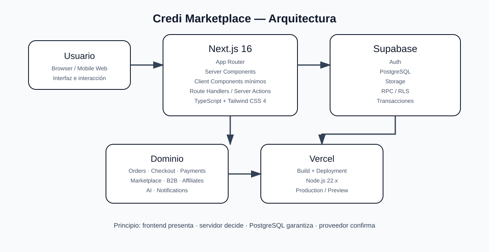

# Credi Marketplace — Arquitectura

> Documento normativo de arquitectura. Debe mantenerse sincronizado con `package.json`, CI/CD, Supabase y Vercel.

## 1. Stack oficial

| Capa | Tecnología |
|---|---|
| Framework | Next.js 16.3.x — App Router |
| UI | React 19.x |
| Lenguaje | TypeScript |
| Runtime CI/producción | Node.js 22.x |
| Gestor de paquetes | npm 10.x |
| Build/dev | Turbopack en desarrollo; `next build` en CI |
| Estilos | Tailwind CSS 4 |
| Backend / DB | Supabase + PostgreSQL |
| Auth | Supabase Auth + SSR |
| Pruebas | Vitest + Testing Library + Playwright |
| Deploy | Vercel |

La versión concreta instalada debe provenir del lockfile. No se deben documentar tecnologías que no formen parte del despliegue oficial.

## 2. Principio rector

Credi Marketplace utiliza una arquitectura full-stack con una frontera clara entre presentación, dominio y persistencia:

```text
Browser
  │
  ▼
Next.js App Router
  │
  ├── Server Components
  ├── Client Components mínimos
  ├── Route Handlers
  └── Server Actions cuando aporten valor
  │
  ▼
Servicios / reglas de dominio
  │
  ├── Auth
  ├── Orders
  ├── Checkout
  ├── Payments
  ├── Affiliates
  ├── B2B
  └── AI
  │
  ▼
Supabase
  ├── Auth
  ├── PostgreSQL
  ├── Storage
  └── RPC
```

**Regla:** el cliente presenta y solicita; el servidor autentica, autoriza y calcula; PostgreSQL mantiene la consistencia; el proveedor de pagos confirma el pago.

## 3. Aplicación Next.js

La aplicación usa App Router. Las páginas y layouts deben permanecer en el árbol `src/app/`. Los componentes deben clasificarse por responsabilidad.

```text
src/
├── app/                 # rutas, layouts, handlers y metadata
├── components/          # UI reutilizable
├── context/             # estado transversal limitado
├── features/            # módulos de dominio
├── hooks/               # hooks reutilizables
├── i18n/                # internacionalización
├── lib/                 # infraestructura y utilidades
├── services/            # servicios de aplicación/dominio
└── types/               # contratos TypeScript
```

No convertir toda la aplicación en `use client`. Los Client Components solo deben existir donde sean necesarios para interacción, estado local o APIs del navegador.

## 4. Autenticación y autorización

Supabase Auth gestiona identidad y sesión. La autorización se decide en servidor y en políticas RLS.

```text
Sesión
  ↓
Identidad
  ↓
Rol / ownership
  ↓
Permiso de operación
  ↓
Acceso a datos
```

El rol enviado por el navegador nunca es una fuente de autoridad.

## 5. Flujo transaccional

Las operaciones de comercio siguen un único flujo conceptual:

```text
Request
  ↓
Input validation
  ↓
Authentication
  ↓
Authorization
  ↓
Read trusted state
  ↓
Business rules
  ↓
Atomic transaction / RPC
  ↓
Persist result
  ↓
Safe response
```

Precios, cantidades, stock, comisiones, vendedor, comprador y estado de pago no se confían al navegador.

## 6. Inventario

El inventario debe actualizarse de forma atómica. Cuando una operación pueda sufrir concurrencia, la lógica debe ejecutarse en PostgreSQL mediante transacción/RPC y no mediante una secuencia vulnerable de lecturas y escrituras desde el cliente.

## 7. Pagos

El sistema separa la creación de la orden de la confirmación del pago:

```text
pending
  ↓
payment initiated
  ↓
provider verification
  ↓
webhook / server confirmation
  ↓
paid
```

El cliente nunca puede convertir una orden en `paid` o `completed` por sí mismo.

## 8. Inteligencia Artificial

La IA es una integración de servidor. Las credenciales de proveedores externos permanecen fuera del bundle del navegador. Los endpoints de IA deben validar entrada, aplicar límites, controlar tiempo de respuesta y evitar la exposición de secretos.

## 9. Seguridad de datos

Las operaciones sensibles deben usar:

- autenticación de servidor;
- autorización por rol/propiedad;
- RLS;
- validación de entrada;
- respuestas sin detalles internos;
- `Cache-Control: no-store` para datos privados;
- trazabilidad mediante identificadores de solicitud cuando corresponda.

## 10. Caché

Los assets versionados pueden aprovechar el caché de Next.js/CDN. Los endpoints transaccionales y privados no deben quedar accidentalmente en caché público.

## 11. Deployment

El proveedor oficial es **Vercel**. El flujo es:

```text
GitHub main
   ↓
Credi Marketplace CI
   ↓
Security Audit
   ↓
Deployment Gate
   ↓
Vercel
```

Vercel es la capa de ejecución/deployment; Supabase continúa siendo la plataforma de backend y persistencia.

## 12. Observabilidad

Los logs deben registrar eventos útiles para diagnóstico sin incluir tokens, claves, contraseñas, cookies, secretos ni datos sensibles innecesarios. Los errores públicos deben usar mensajes estables y los detalles técnicos deben quedar en servidor.

## 13. Reglas arquitectónicas no negociables

1. TypeScript como lenguaje del proyecto.
2. App Router; no Pages Router.
3. Node.js 22.x y npm 10.x en la línea CI/CD.
4. Tailwind CSS 4.
5. Supabase como backend/base de datos.
6. Vercel como plataforma de despliegue.
7. Secretos únicamente en servidor/entornos protegidos.
8. RLS y autorización real para datos privados.
9. El cliente no decide pagos, precios ni stock definitivo.
10. Nada de microservicios, Kubernetes, Elasticsearch o Redux como complejidad inicial sin una necesidad técnica demostrable.

## 14. Diagrama de referencia



## 15. Fuente de verdad

Cuando este documento entre en conflicto con la configuración ejecutable, la corrección debe hacerse en código/configuración y después actualizar esta documentación. La documentación no sustituye las validaciones de CI ni las políticas reales de Supabase/Vercel.
