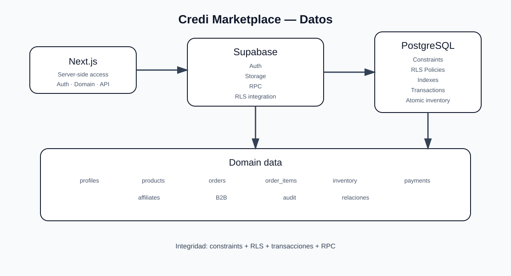

# Credi Marketplace — Arquitectura de Base de Datos

> Fuente documental para el modelo de persistencia. La estructura ejecutable reside en Supabase/PostgreSQL y sus migraciones.

## 1. Plataforma

Credi Marketplace utiliza **Supabase como backend** y **PostgreSQL como base de datos relacional**.

```text
Next.js
  ↓
Supabase
  ├── Auth
  ├── PostgreSQL
  ├── Storage
  └── RPC
```

El navegador no accede directamente a PostgreSQL con credenciales privilegiadas.

## 2. Responsabilidades de datos

El dominio contempla, según las funcionalidades activas del proyecto:

| Dominio | Responsabilidad |
|---|---|
| `auth.users` | Identidad gestionada por Supabase Auth |
| `profiles` | Perfil, rol y estado del usuario |
| Productos | Catálogo y estado comercial |
| Órdenes | Ciclo de vida de compras |
| `order_items` | Líneas y cantidades de órdenes |
| Inventario | Disponibilidad y operaciones de stock |
| Pagos | Referencias y estados de pago |
| Afiliados | Atribución y comisiones |
| B2B | Operaciones mayoristas |
| Auditoría | Trazabilidad de operaciones sensibles |

Los nombres exactos de tablas deben considerarse contrato de implementación y verificarse contra las migraciones actuales antes de añadir nuevas referencias.

## 3. Principios de integridad

### 3.1 Fuente de verdad

Precios, stock, estados financieros, roles y ownership deben validarse contra datos confiables del servidor.

### 3.2 Atomicidad

Las operaciones que modifican múltiples registros relacionados deben ejecutarse dentro de una transacción o una función RPC apropiada.

### 3.3 Idempotencia

Checkout, creación de órdenes, pagos y webhooks deben diseñarse para tolerar reintentos sin duplicar efectos.

### 3.4 Integridad financiera

Una orden `pending` no equivale a un pago confirmado. El cambio a `paid` debe producirse únicamente mediante una verificación confiable del proveedor de pagos y lógica de servidor.

## 4. Row Level Security

Las tablas que contengan información privada o mutaciones de negocio deben evaluarse con **RLS**.

```text
RLS
 ↓
usuario autenticado
 ↓
ownership / rol
 ↓
acción permitida
```

Ocultar una ruta del frontend no constituye protección de datos.

La política correcta debe definir, según cada tabla, qué operaciones de `SELECT`, `INSERT`, `UPDATE` y `DELETE` son admisibles.

## 5. Roles y ownership

Los permisos se determinan en servidor utilizando la identidad autenticada y los datos persistidos.

Un cliente no puede elevar sus privilegios enviando un `role` distinto en el payload.

Para recursos propios debe validarse explícitamente el ownership, por ejemplo:

```text
request.user_id == resource.owner_id
```

cuando el modelo de datos aplique esa relación.

## 6. Inventario y concurrencia

Nunca utilizar como mecanismo único:

```text
SELECT stock
↓
comprobar stock
↓
UPDATE stock
```

para operaciones concurrentes.

El flujo seguro es:

```text
BEGIN
  ↓
bloqueo/validación transaccional
  ↓
comprobar stock
  ↓
crear o actualizar orden
  ↓
actualizar inventario
  ↓
COMMIT
```

La implementación preferente es una RPC de PostgreSQL para las operaciones críticas.

## 7. Migraciones

La evolución del esquema debe realizarse mediante migraciones versionadas:

```text
supabase/
└── migrations/
```

Una migración debe ser:

- determinista;
- revisable en Git;
- segura para el entorno objetivo;
- acompañada de las políticas/índices necesarios;
- compatible con el código que la consume.

No realizar cambios manuales permanentes en producción que no queden representados en migraciones.

## 8. Índices

Los índices deben corresponder a consultas reales y rutas críticas. Como mínimo deben revisarse las búsquedas por:

```text
id
slug
owner/seller
estado
created_at
relaciones de órdenes
referencias transaccionales
```

No agregar índices indiscriminadamente: cada índice tiene coste de almacenamiento y de escritura.

## 9. Constraints

La integridad debe reforzarse con PostgreSQL cuando sea posible:

```text
PRIMARY KEY
FOREIGN KEY
UNIQUE
NOT NULL
CHECK
```

Las reglas esenciales no deben depender únicamente de validaciones TypeScript del cliente.

## 10. Auditoría

Las operaciones administrativas y financieras deben permitir trazabilidad suficiente para responder:

```text
qué ocurrió
quién lo ejecutó
cuándo ocurrió
qué recurso afectó
resultado
request/correlation id cuando exista
```

Los logs de aplicación nunca deben almacenar secretos o credenciales.

## 11. Storage

Los archivos deben almacenarse en **Supabase Storage** cuando correspondan al dominio de archivos de la plataforma. El servidor de Next.js no debe utilizarse como almacenamiento permanente de vídeos u otros archivos de usuario.

El acceso a objetos privados debe controlarse mediante políticas, sesiones o URLs firmadas según el caso de uso.

## 12. Separación por entorno

Producción y preview/desarrollo deben mantener límites claros de datos y credenciales. Siempre que sea viable, utilizar proyectos de Supabase separados para evitar contaminación entre entornos.

## 13. Flujo de una orden

```text
Cliente
  ↓
Next.js /api/orders
  ↓
Auth + authorization
  ↓
Validación de input
  ↓
RPC / transacción PostgreSQL
  ├── producto activo
  ├── precio real
  ├── stock
  ├── afiliado
  ├── order
  └── inventory
  ↓
pending
```

## 14. Flujo de pago

```text
pending
  ↓
payment initiated
  ↓
provider
  ↓
webhook verificado
  ↓
servidor
  ↓
paid
```

El navegador nunca constituye prueba de pago.

## 15. Control de cambios

Antes de modificar el esquema:

```bash
npm run lint
npm run typecheck
npm run test
npm run build
```

y validar las migraciones y políticas en un entorno de prueba antes de producción.

## 16. Diagrama de referencia



## 17. Regla definitiva

**PostgreSQL garantiza integridad; RLS controla acceso a filas; RPC/transacciones protegen operaciones atómicas; Next.js aplica autenticación y reglas de aplicación.**
