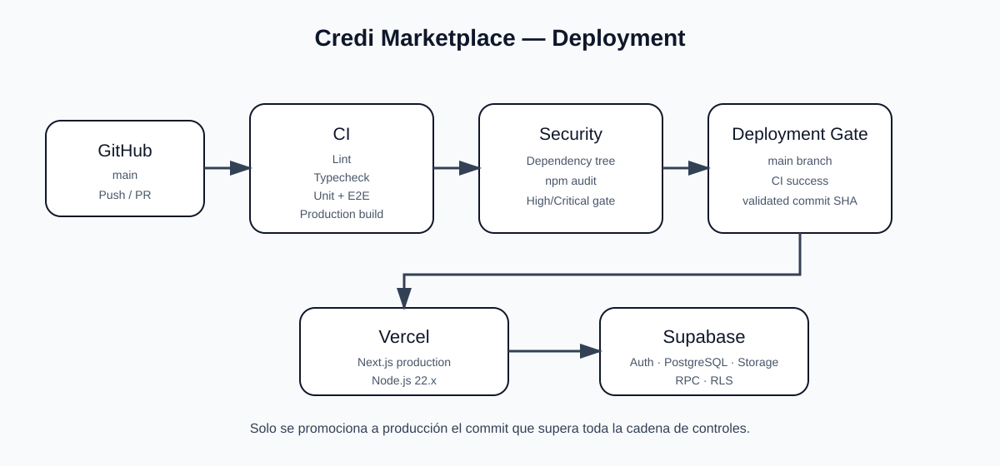

# Credi Marketplace — Guía de Despliegue

> Runbook oficial de despliegue. La plataforma objetivo es **Vercel** y el backend es **Supabase**.

## 1. Stack de producción

| Componente | Estándar |
|---|---|
| Framework | Next.js 16.3.x + App Router |
| UI | React 19.x |
| Runtime | Node.js 24.x LTS |
| npm | 11.x |
| CSS | Tailwind CSS 4 |
| Backend | Supabase |
| Database | PostgreSQL |
| Auth | Supabase Auth / SSR |
| Deploy | Vercel |

El proyecto declara Node.js 24.x y npm 11.x en `package.json`, y `.nvmrc` contiene `24`.

## 2. Pipeline obligatorio

Ningún despliegue de producción debe saltarse la línea de validación:

```text
Git push / Pull Request
        ↓
Credi Marketplace CI
        ↓
Security Audit
        ↓
Deployment Gate
        ↓
Vercel
```

El CI valida estructura, dependencias, ESLint, TypeScript, pruebas unitarias, E2E y build. Security valida vulnerabilidades de dependencias. El Deployment Gate solo autoriza un CI exitoso de `main`.

## 3. Instalación reproducible

Usar el lockfile como fuente de resolución:

```bash
npm ci
```

No reemplazar `npm ci` por `npm install` en CI.

## 4. Validación local previa

Antes de publicar:

```bash
npm run lint
npm run typecheck
npm run test
npm run test:e2e
npm run build
npm audit --audit-level=high
```

El comando oficial de validación completa definido por el proyecto es `npm run check:all` cuando las variables y servicios requeridos están disponibles.

## 5. Vercel

Conectar el repositorio de GitHub con el proyecto de Vercel y mantener producción vinculada a `main`.

La configuración de Vercel debe respetar:

```text
Node.js 24.x LTS
npm 11.x
Next.js App Router
```

No utilizar OpenNext para un despliegue Vercel de este proyecto.

## 6. Variables de entorno

Separar estrictamente variables públicas de secretos.

Las variables públicas de Supabase son `NEXT_PUBLIC_SUPABASE_URL` y `NEXT_PUBLIC_SUPABASE_PUBLISHABLE_KEY`. Las credenciales privilegiadas permanecen server-only y nunca se colocan en el cliente.

## 7. Supabase

Supabase permanece como backend/base de datos. Antes de una liberación revisar:

```text
migrations
RLS
RPC
índices
triggers
constraints
webhooks
```

Las migraciones deben estar versionadas en Git. Los cambios de esquema hechos manualmente en producción deben evitarse.

## 8. Preview vs Production

Mantener separados los entornos y sus secretos.

## 9. Build de producción

El build oficial es:

```bash
npm run build
```

Un build exitoso no reemplaza las pruebas ni la auditoría de seguridad.

## 10. Caché y datos privados

Las rutas transaccionales y privadas deben evitar caché público accidental:

```text
/api/auth/*
/api/orders/*
/api/checkout/*
/api/payments/*
/api/ai/*
```

## 11. Dominio y HTTPS

Producción debe usar HTTPS y un dominio canónico definido.

## 12. Webhooks

Los webhooks de proveedores externos deben apuntar al endpoint público correcto de producción y validar autenticidad antes de modificar órdenes o pagos.

## 13. Rollback

Ante una regresión, identificar el commit/deployment, ejecutar rollback en Vercel, verificar salud y registrar el incidente.

## 14. Checklist de liberación

```text
[ ] CI verde
[ ] Security verde
[ ] Deployment Gate aprobado
[ ] Variables correctas
[ ] Supabase/migraciones verificadas
[ ] RLS verificado
[ ] Webhooks verificados
[ ] Build exitoso
[ ] Smoke test posterior al deploy
```

## 15. Smoke test posterior

Comprobar al menos inicio, autenticación, catálogo, producto, carrito, checkout, orden, API principal y webhooks cuando apliquen.

## 16. No hacer

No introducir en el pipeline de despliegue:

```text
Cloudflare como plataforma principal
OpenNext
Pages Router
Node.js 22.x
npm 10.x
credenciales en el repositorio
secretos NEXT_PUBLIC_*
```

La plataforma oficial documentada es **Vercel + Supabase + Node.js 24.x LTS + npm 11.x**.

## 17. Diagrama



## 18. Principio final

**Solo se despliega el código que haya superado CI, Security y el Deployment Gate sobre el commit validado.**
