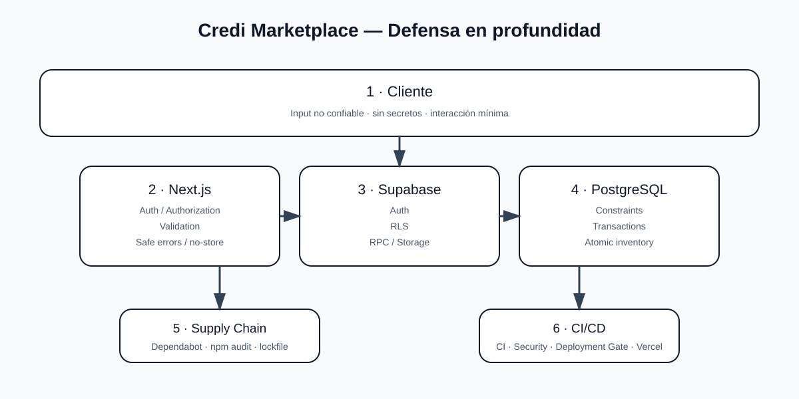

# Credi Marketplace — Seguridad

> Modelo de seguridad de la aplicación. Este documento distingue controles arquitectónicos de controles que deben verificarse continuamente mediante código, Supabase, CI/CD y Vercel.

## 1. Modelo de confianza

```text
Browser = NO CONFIABLE
        ↓
Next.js server boundary
        ↓
Auth + Authorization + Validation
        ↓
Supabase / PostgreSQL
        ↓
Atomic business operation
```

Todo input procedente del navegador debe tratarse como potencialmente manipulado.

## 2. Controles fundamentales

| Control | Regla |
|---|---|
| Autenticación | Supabase Auth + sesión server-side |
| Autorización | Rol + ownership + reglas servidor |
| Datos | RLS para recursos privados |
| Entrada | Validación TypeScript/Zod según contrato |
| Pagos | Confirmación server-side/webhook verificado |
| Inventario | Operaciones atómicas/transaccionales |
| Secretos | Solo server-side / variables protegidas |
| API | Respuestas seguras y límites de abuso |
| Caché | Sin caché público para datos privados |
| CI | Lint + typecheck + tests + E2E + build |
| Dependencias | `npm audit --audit-level=high` |

## 3. Autenticación

La identidad se obtiene de Supabase Auth. Una sesión válida no implica autorización para cualquier recurso.

```text
authenticated
   ↓
who?
   ↓
role / ownership
   ↓
allowed action?
```

No aceptar cambios de rol enviados por el cliente como autoridad.

## 4. Autorización

Las operaciones administrativas, comerciales y financieras deben validar permisos en servidor.

Regla conceptual:

```text
User → Resource → Action
             ↓
          ALLOWED?
```

La protección de una ruta en la UI nunca sustituye la autorización real.

## 5. Supabase RLS

Las tablas privadas deben usar Row Level Security de acuerdo con el modelo real de datos.

RLS debe revisarse para:

```text
SELECT
INSERT
UPDATE
DELETE
```

Especial atención a perfiles, órdenes, inventario, pagos, afiliados, entidades B2B y datos de vendedores/compradores.

## 6. Secretos

Nunca colocar secretos en:

```text
NEXT_PUBLIC_*
source code
Git
logs
responses HTTP
Client Components
```

Ejemplos de secretos server-only:

```env
SUPABASE_SERVICE_ROLE_KEY=...
GEMINI_API_KEY=...
PAYMENT_SECRET=...
PAYMENT_WEBHOOK_SECRET=...
```

Las claves con privilegios elevados deben utilizarse únicamente donde sean estrictamente necesarias.

## 7. Validación de entrada

Las APIs deben validar:

```text
tipo
longitud
formato
rangos
estado
ownership
relaciones
```

Nunca confiar en `price`, `total`, `stock`, `role`, `seller_id`, `buyer_id` o `status` procedentes del cliente cuando esos valores deban determinarse en servidor.

## 8. Seguridad financiera

El flujo correcto es:

```text
Order created
   ↓
pending
   ↓
payment initiated
   ↓
provider
   ↓
verified webhook / server confirmation
   ↓
paid
```

Nunca:

```text
Browser → paid=true → Database
```

## 9. Idempotencia

Las operaciones que produzcan efectos financieros deben poder tolerar reintentos.

Aplicar controles de idempotencia a:

```text
checkout
orders
payments
webhooks
```

La misma solicitud no debe generar efectos duplicados.

## 10. Inventario y concurrencia

El stock no debe actualizarse mediante una secuencia vulnerable de lectura y escritura desde el cliente.

```text
transaction / RPC
   ↓
validate stock
   ↓
create order
   ↓
update inventory
   ↓
commit
```

## 11. APIs

Las respuestas deben evitar detalles internos.

Incorrecto:

```json
{
  "error": "Postgres relation xyz failed..."
}
```

Correcto:

```json
{
  "success": false,
  "error": "No fue posible completar la operación.",
  "code": "OPERATION_FAILED"
}
```

Los detalles técnicos permanecen en logs internos.

## 12. Rate limiting y abuso

Los endpoints públicos o costosos deben tener controles de frecuencia apropiados para su riesgo, especialmente:

```text
login / auth
AI
checkout
orders
webhooks
```

El límite debe considerar usuario, IP, operación, costo y comportamiento cuando corresponda.

## 13. IA

La integración de IA debe:

```text
validar input
↓
limitar tamaño
↓
controlar frecuencia
↓
timeout
↓
llamar proveedor desde servidor
↓
sanear respuesta
```

La API key nunca se entrega al navegador.

## 14. Headers

Next.js debe mantener cabeceras de seguridad apropiadas, incluyendo protección contra MIME sniffing, HSTS en producción, política de referrer y Permissions Policy. La CSP debe reflejar únicamente los orígenes realmente necesarios.

## 15. Cookies y sesión

Las cookies de autenticación deben conservar las propiedades de seguridad compatibles con Supabase SSR y el flujo de aplicación. No almacenar tokens sensibles únicamente en `localStorage` como sustituto de una sesión segura.

## 16. CORS y CSRF

No abrir CORS globalmente sin necesidad. Los endpoints que acepten operaciones de escritura deben diseñarse para rechazar orígenes o solicitudes no autorizadas según el modelo de sesión utilizado.

## 17. Dependencias

El pipeline de Security debe validar el árbol de dependencias y ejecutar:

```bash
npm audit --audit-level=high
```

Las actualizaciones automáticas se gestionan mediante Dependabot y deben pasar por CI antes de integrarse a `main`.

## 18. Supply chain

Proteger:

```text
package-lock.json
GitHub Actions
Dependabot
CODEOWNERS
CI
Deployment Gate
```

Las acciones de GitHub deben mantenerse actualizadas y cualquier modificación del pipeline debe pasar por revisión.

## 19. CI/CD seguro

El orden oficial es:

```text
CI
 ↓
Security
 ↓
Deployment Gate
 ↓
Vercel
```

El gate no sustituye CI ni Security; únicamente autoriza el paso posterior después de validar el workflow requerido.

## 20. Datos sensibles

No registrar innecesariamente:

```text
passwords
access tokens
refresh tokens
service-role keys
payment secrets
cookies
API keys
```

Aplicar mínimo privilegio y mínima exposición de datos.

## 21. Auditoría

Las operaciones críticas deben poder correlacionarse mediante identificadores de solicitud y registros internos suficientes para investigar incidentes sin almacenar secretos.

## 22. Gestión de incidentes

Ante un evento de seguridad:

```text
Detectar
  ↓
Contener
  ↓
Preservar evidencia técnica
  ↓
Revocar/rotar credenciales afectadas
  ↓
Corregir
  ↓
Validar CI/Security
  ↓
Desplegar
  ↓
Documentar
```

## 23. Checklist de seguridad

```text
[ ] No secrets en Git
[ ] No secrets en NEXT_PUBLIC_*
[ ] Auth validada en servidor
[ ] Authorization validada en servidor
[ ] RLS revisado
[ ] Input validation
[ ] Rate limiting apropiado
[ ] Pagos verificados server-side
[ ] Inventario atómico
[ ] Idempotencia
[ ] Headers seguros
[ ] CI verde
[ ] npm audit verde
[ ] Deployment Gate verde
```

## 24. Diagrama



## 25. Regla definitiva

**La seguridad no pertenece a una sola capa: cliente, Next.js, Supabase/PostgreSQL, dependencias, GitHub Actions y Vercel deben trabajar como un único sistema de defensa en profundidad.**
